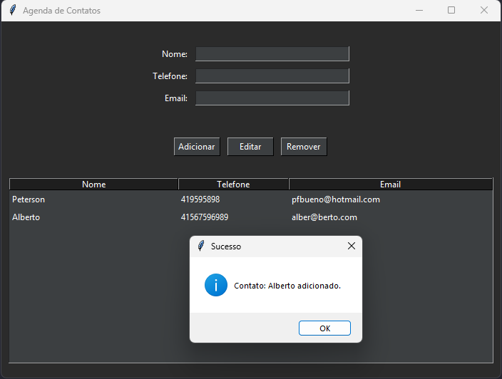
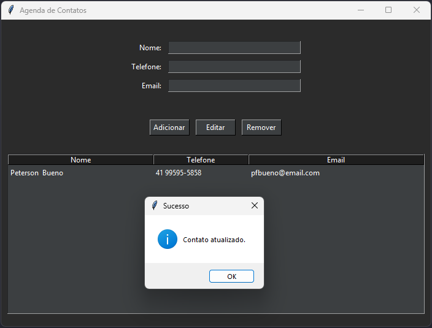
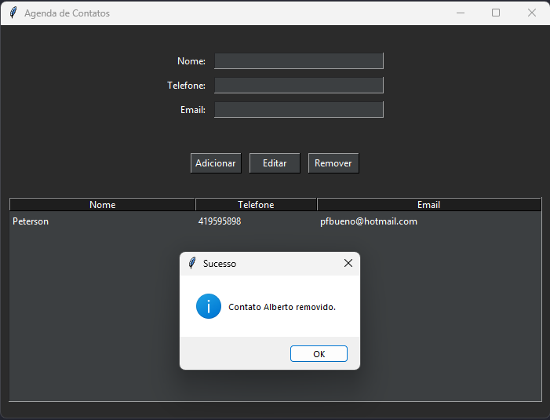
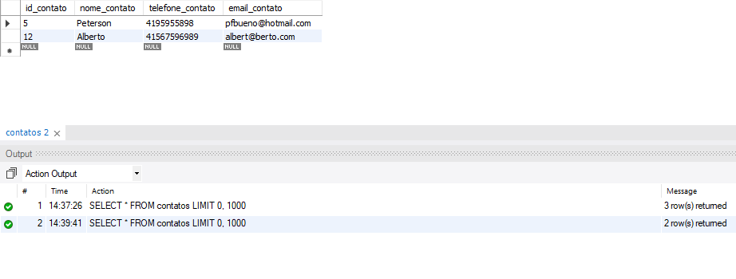

# 📱 Agenda de Contatos - Tkinter + MySQL

Projeto desenvolvido com foco educacional (Sob tutoria do professor Wanderson, Obrigado pelo apoio!)

Utilizando **Python com Tkinter e MYSQL** para criação de uma interface gráfica simples e funcional de gerenciamento de contatos.

---

## 📉 Demonstração Visual

####  Contato Adicionado: 

> *()*

####  Contato Atualizado: 

> *()*

####  Contato Removido: 

> *()*

####  Consulta no Banco: 

> *()*

---

## 🔧 Objetivos do Projeto

* Entender o funcionamento da biblioteca **Tkinter** com classes
* Aprender a estruturar um sistema com **modularização de responsabilidades** (`core`, `gui`, `db`, `utils`)
* Praticar uso do **Treeview** (do ttk) para exibição em tabela
* Aplicar **integração com banco de dados MySQL**
* Usar **variáveis de ambiente** para proteger credenciais

---

## 🤖 Tecnologias Utilizadas

* Python 3.10+
* Tkinter (interface gráfica)
* ttk (tema + Treeview)
* MySQL
* dotenv (gerenciamento de variáveis sensíveis)
* mysql-connector-python

---

## 🔄 Estrutura Modular

```
agenda_de_contatos/
├── Main.py                  # Arquivo principal de execução
├── core/                    # Regras de negócio
│   ├── agenda.py
│   └── contato.py
├── gui/                     # Interface Tkinter
│   └── interface.py
├── db/                      # Acesso ao banco de dados
│   ├── conexao.py
│   └── agenda.sql           # Script de criação da tabela
└── utils/                   # Configuração de ambiente
    └── db_config.py
```

---

## 📃 Banco de Dados MySQL

Utilize o arquivo `agenda.sql` na pasta `/db` para criar a tabela no seu banco:

```sql
CREATE TABLE contatos (
    id INT AUTO_INCREMENT PRIMARY KEY,
    nome VARCHAR(100) NOT NULL,
    telefone VARCHAR(20) NOT NULL,
    email VARCHAR(100) -- Deixei Opcional
);
```

> Obs: Certifique-se de que o banco esteja criado e acessível localmente.

---

## 🔐 .env - Variáveis de Ambiente

Crie um arquivo `.env` na raiz do projeto (ou em `/utils`) com os seguintes dados:

```
DB_HOST=localhost
DB_USER=seu_usuario
DB_PASSWORD=sua_senha
DB_NAME=agenda
```

Esses dados serão lidos automaticamente pela aplicação via `dotenv`.

---

## 🚀 Como Rodar o Projeto

```bash
# Clone o repositório:
git clone https://github.com/peter-bueno/Agenda-de-Contatos-TKinter.git
cd Agenda-de-Contatos-TKinter

# Execute a aplicação
py agenda_de_contatos/Main.py
```

> Certifique-se que seu MySQL esteja rodando e o `.env` configurado corretamente.

---

## 📈 Melhorias Futuras (Sugestões)

* Implementar recurso de busca por nome
* Paginação ou scroll na tabela
* Confirmação antes de excluir contatos
* Testes unitários para as classes do `core`
* Adição de mais campos (ex: aniversário, grupo, etc.)

---

## 🙌 Feito com propósito de aprendizado e muita dedicação por [Peterson Ferreira Bueno](https://github.com/peter-bueno)
